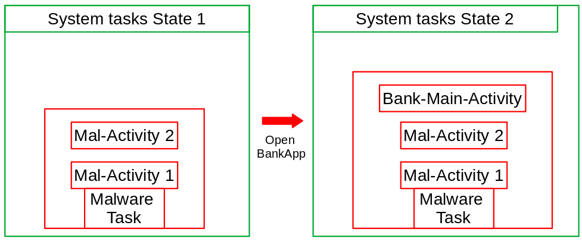

# Task Hijacking

## <mark style="color:purple;">Introduction</mark>

Task hijacking is a vulnerability that affects Android applications due to the configuration of Task Control features in the `AndroidManifest.xml` file. This flaw can allow an attacker or a malicious app to take over legitimate apps, potentially leading to information theft.

**Scenario**

<figure><figcaption><p>Based on "Android Task hijacking" by Evgeny Blashko &#x26; Yury Shabalin in "Positive Hack Days - PHDays VII Hacking conference"</p></figcaption></figure>

**Security implication (this scenario)**

When the back button is pressed on `Bank-Main-Activity`, the user will go to the `Mal-Activity 2` .


**Note**:&#x20;

* There are many other scenarios, in this case we focus only on this one. For more details on other scenarios, refer to \[[🔗](https://www.youtube.com/watch?v=lLBeoufO_Bc)]. Slides \[[🔗](https://www.slideshare.net/slideshow/android-task-hijacking/76515201)].
* The only real remediation is update to `android:minSdkVersion="28"`.


**Requirements:**

* The app can be installed on **Android SDK version < 28 (Android 9)**. Check `android:minSdkVersion` is < 28 in `AndroidManifest.xml`
  * This vulnerability is patched from **Android SDK version 28**. \[[🔗](https://developer.android.com/privacy-and-security/risks/strandhogg)]&#x20;
* `android:launchMode="singleTask"` in `AndroidManifest.xml` (necessary for this scenario)

## <mark style="color:purple;">**Testing**</mark>

You can use malware apk by ivan sincek \[[🔗](https://github.com/ivan-sincek/malware-apk)].

To hijack a task, modify the task affinity in `AndroidManifest.xml` of `malware.apk` under `MainActivity`. Set it to `PackageNameVictim` and rebuild the APK.

Example:

```xml
<! -- AndroidManifest.xml victim.apk -->
<manifest ... package="com.victim.bank" ...>

<! -- AndroidManifest.xml malware.apk -->
<activity android:name="com.kira.malware.activities.MainActivity" android:exported="true" android:taskAffinity="com.victim.bank" ...>
```
